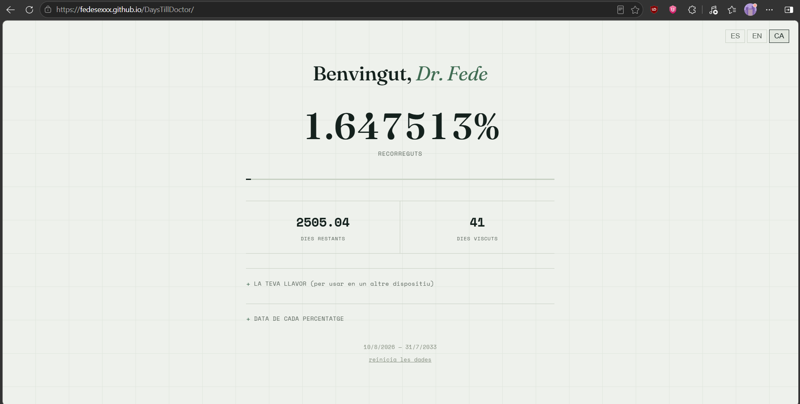

# DaysTillDoctor🩺

**A live countdown to finishing medical school.**

[](LICENSE)

**DaysTillDoctor** is a simple live countdown html website tracking the time remaining until my (and hopefully yours) medical school graduation.

---

## Features

- Smooth real-time countdown
- Graduation date tracking
- Generates a unique personal seed to restore your data on any device
- Data saved locally to your device
- Available in Catalan, English, and Spanish

---

## Preview

<p align="center">
  
</p>

---

## Live version

Try it yourself here:

### 👉 [fedesexxx.github.io/DaysTillDoctor](https://fedesexxx.github.io/DaysTillDoctor/)

---

## Run locally

Clone the repository:

```bash
git clone https://github.com/fedesexxx/DaysTillDoctor.git
```

Enter the project directory:

```bash
cd DaysTillDoctor
```

Then open `index.html` in your browser.

---

## Roadmap

Possible future improvements:

- [ ] Graduation milestone animations
- [ ] Dark/light mode
- [ ] Shareable countdown links

---

## License

This project is licensed under the MIT License.

See the [`LICENSE`](LICENSE) file for details.
